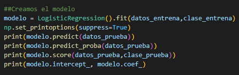

# Regresión Logística y calculo de probabilidades

Para realizar la siguiente practica fue necesario utilizar las siguientes librerias, en esta practica se intentara crear un modelo para saber si a un individuo le gustan los videojuegos.
* Sklearn para utilizar la regresión logistica y utilizar un muestreo.
* matplotlib para imprimir una grafica con los datos
* Y numpy para crear una función que nos de la posibilidad según los datos

### Primer paso 
El primer paso fue crear una función basados en la siguiente formula.

Esta funcion nos servira para calcular de manera grafica el modelo de regresión logistica, así como para saber la probabilidad de que a un individuo le gusten o no los videojuegos.

### Paso dos

Definimos los datos de prueba, en la lista edades se definen las edades de los individuos de muestra y en la lista clase es si le gustan o no los videojuegos.

### Paso tres

Sacamos una muestra aleatoria de los datos previamente ingresados utilizando train_test_split (En este caso el 50%).

### Paso cuatro

Ahora utilizando la libreria sklearn creamos el modelo utilizando los datos de muestra, e imprimimos los datos de prueba, la probabilidad de que le gusten y no le gusten los videojuegos a cada individuo de la muestra, que tan acertado fue nuestro modelo con respecto a los datos de prueba y dos datos para crear la grafica

### Ultimo paso

Por ultimo creamos la grafica. Primero graficamos una linea azul que son los limites de nuestra muestra (5,80) y que utilice nuestra función logistica para darle un valor en y.

Los datos de  muestra se mostraran como un punto verde.

Después definimos nuevos individuos para saber la probabilidad de que le gusten o no los videojuegos de 40, 18 y 15 años.

Esta probabilidad se obtiene utilizando la función logistica y apareceran como estrellas en la grafica.

Como se puede ver a los individuos de 18 y 15 años es bastante probable que le gusten los videojuegos (Entre 70% y 80%) mientras que para alguien de 40 es bastante menos probable (Un 40%). Como se puede ver la linea azul no coincide del todo con los datos de muestra, esto es porque la muestra es muy pequeña y los resultados suelen ser más imprecisos, además de que solo se utiliza la variable de la edad por lo que no se podría tomar como una probabilidad 100% confiable, pero esto nos da una buena entrada a la regresión logistica y a comprender como se puede utilizar